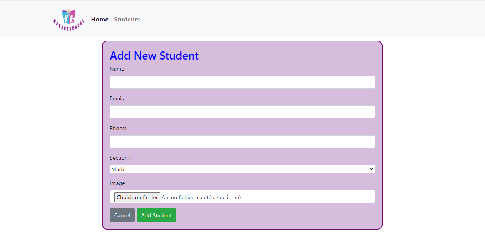

# ManageSchool
### Student Management System with Laravel 8 et MySQL

## Overview
This project is a Student Management System implemented as a CRUD (Create, Read, Update, Delete) application using Laravel 8. The system provides basic functionality for managing students, including an overview page and a student list page with options to edit and view detailed information.

## Features

### Home
The home page serves as the landing page, providing an introduction to the Student Management System. It may include a brief description, the logo of the application, and any other relevant information.

---
---

### Student List
The Student List page displays a list of all registered students.
A summary of each student's key information, such as name, student ID, and contact details.

---
---

### Add Student
The Add Student page contains a form for adding new students. The form includes fields for the student's name, email, phone number, section, and photo.

---
---

### Edit Student
- Allows users to edit the details of a specific student. This includes updating personal information, contact details, and any other relevant data.

---
---

### View Student
- Provides a detailed view of a student's information. This page may include additional details such as academic records, attendance, or any other relevant information.

---
---

### Delete Student
    To delete a student, navigate to the Student List page and click on the "Delete" button associated with the student you wish to remove.
    Upon clicking the "Delete" button, a confirmation alert will appear to ensure that the user intends to delete the selected student.

---
---
---
---

### How to Run the Project
1. Clone the repository to your local machine.
    git clone https://github.com/rihabcherni/ManageSchool.git

2. Navigate to the project directory.
    cd ManageSchool

3. Install dependencies using Composer.
    composer install

4. Copy the .env.example file to .env and configure your database settings.

5. Generate application key.
    php artisan key:generate

6. Run migrations and seed the database.
    php artisan migrate --seed

7. Start the development server.
    php artisan serve

8. Access the application in your browser at http://localhost:8000.

### Contributors
#### Cherni Rihab 

Enjoy managing students with Laravel 8!
